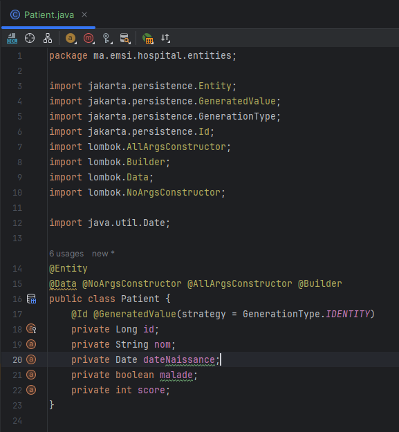
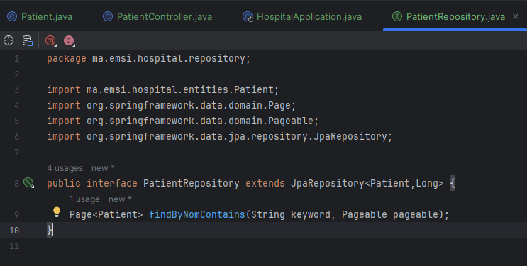
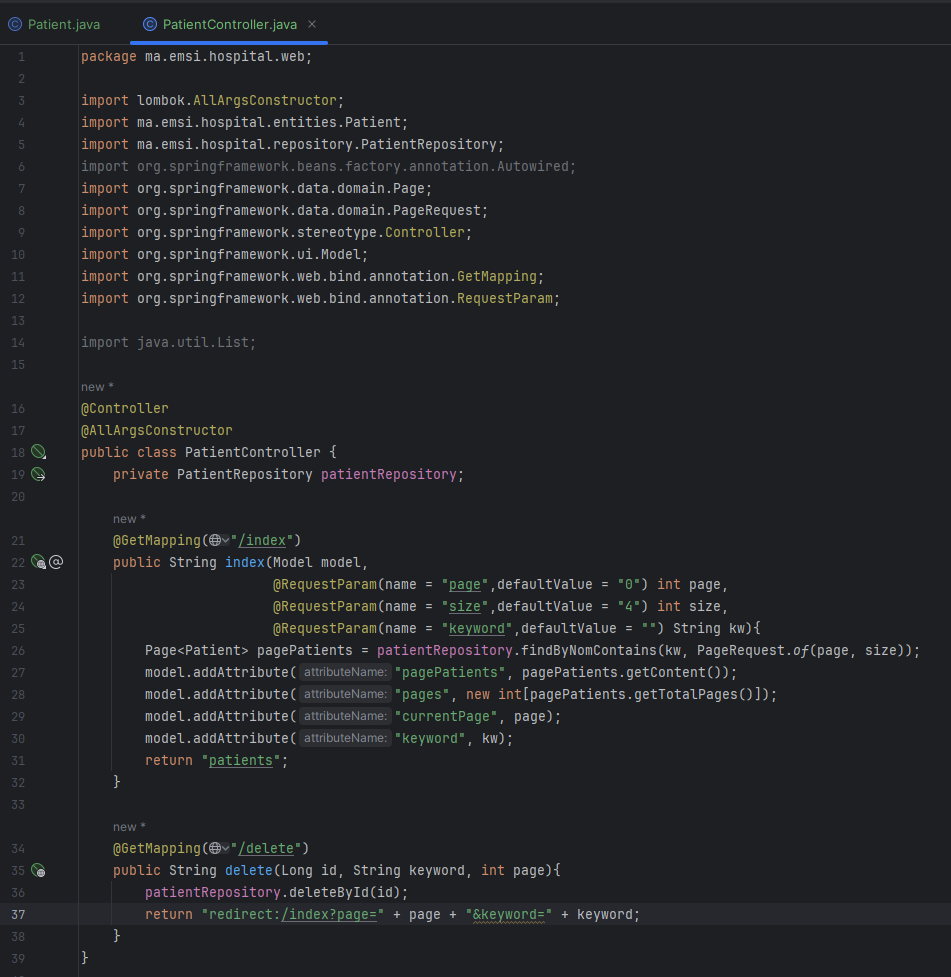
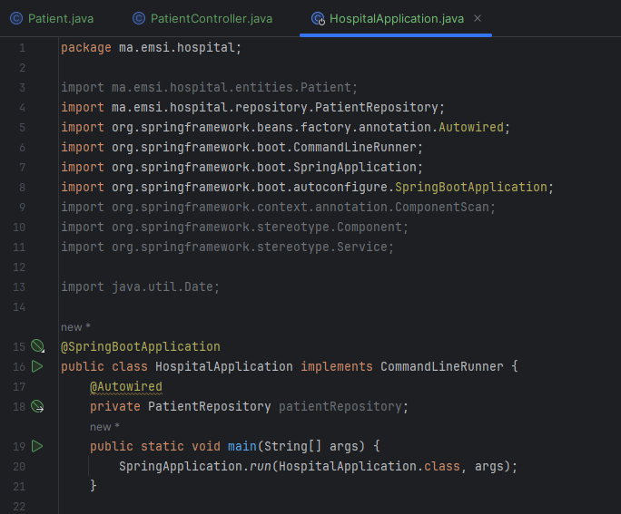
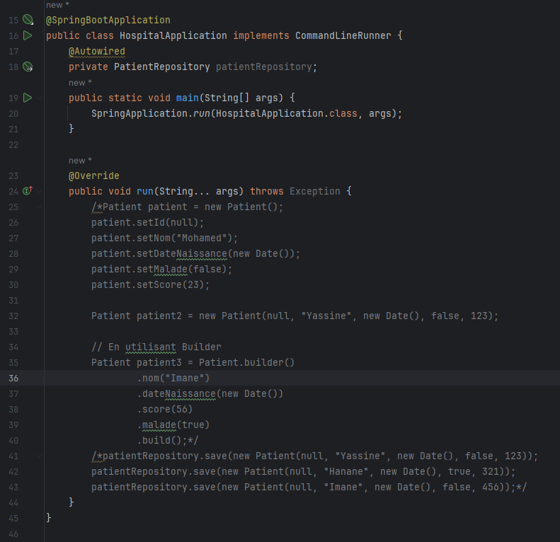
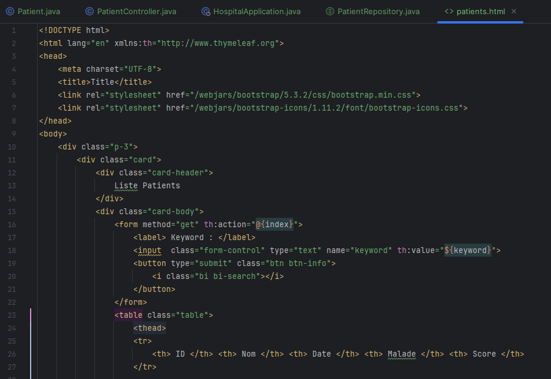
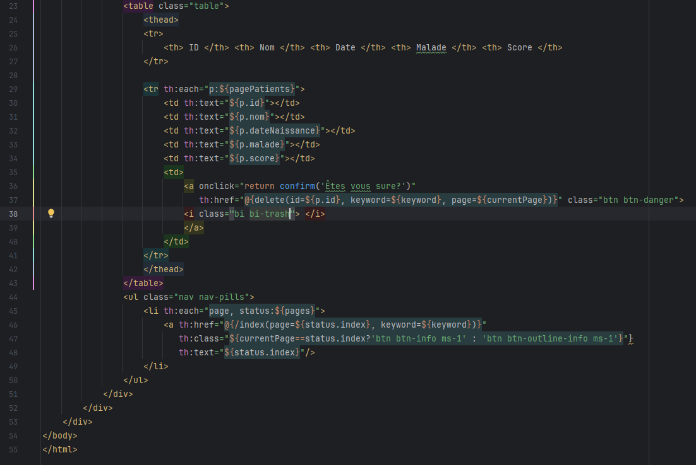
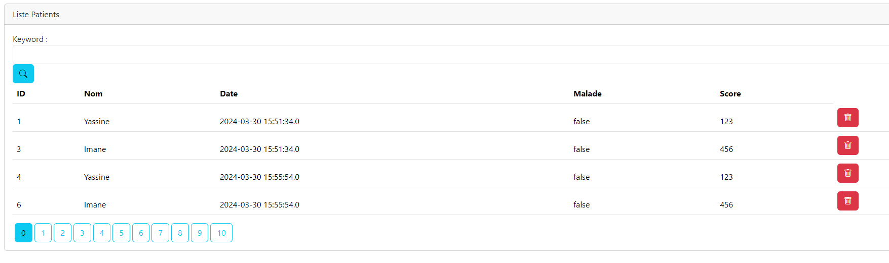

<h3>Activité Pratique N°3   </h3>

1. Classe Patient :

2. Interface Patient Repository :

3. Controller Patient :

4. Applications :

( Les 3 différentes méthodes d'ajout du patient )

5. Affichage des patients dans une template Thymeleaf:

6. Résultat final :

